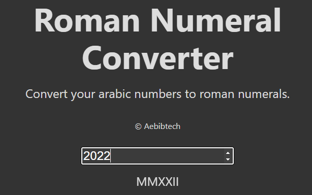

# Arabic to Roman Numeral Converter

This is an app that converts Arabic numbers to Roman numerals. This is a front-end for the Arabic Roman Numeral converter that I previously did as compliance to freeCodeCamp's JavaScript Algorithms and Data Structures certitification. This app utilizes React and Next.js.  

Try it at <https://arab2roman.aebibtech.com>.

## Screenshot

